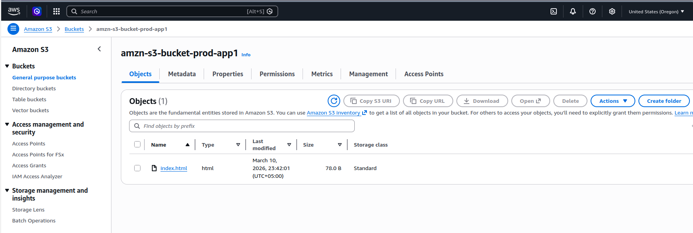
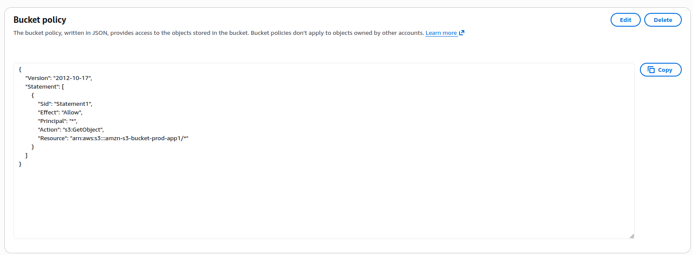

# hosted a static website on aws s3

## about

what is this project?

i hosted a static website using amazon s3. the website is publicly accessible from anywhere on the internet using the s3 bucket website endpoint.

why s3 for static hosting?

s3 is one of the cheapest and simplest ways to host a static website on aws. there are no servers to manage and you only pay for what you use.

## steps i followed

### 1. created an s3 bucket

i went to the aws console, searched for s3, and created a new bucket with a globally unique name. s3 bucket names must be unique across all aws accounts.



### 2. enabled static website hosting

inside the bucket, i went to **properties** → **static website hosting** → **edit** and enabled it. i set the index document to `index.html` and saved the changes. aws then gave me a bucket website endpoint url.


### 3. configured bucket policy for public access

i went to **permissions** → disabled **block public access**, then added the following bucket policy to allow anyone to read the files:

```json
{
  "Version": "2012-10-17",
  "Statement": [
    {
      "Sid": "PublicReadGetObject",
      "Effect": "Allow",
      "Principal": "*",
      "Action": "s3:GetObject",
      "Resource": "arn:aws:s3:::YOUR-BUCKET-NAME/*"
    }
  ]
}
```



### 4. uploaded index.html and accessed the website

i uploaded my `index.html` file to the bucket and opened the bucket website endpoint url in the browser. the static website loaded successfully.


